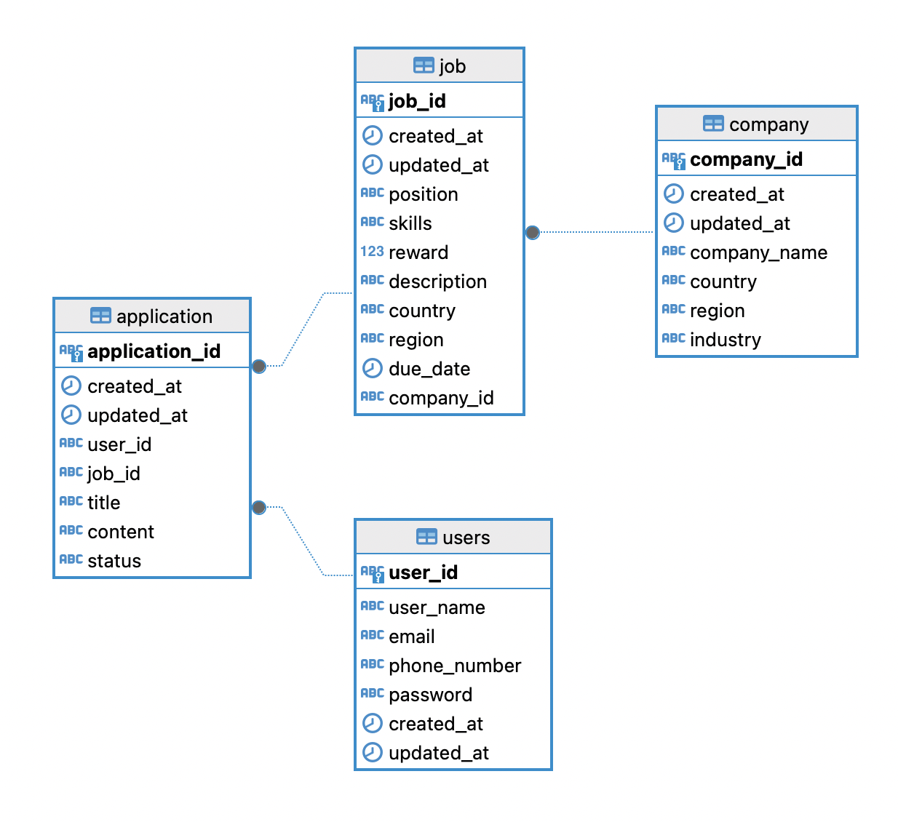

# wanted-pre-onboarding-backend

프리온보딩 백엔드 인턴십 선발과제

# 사용 기술

- Node.js
- TypeScript
- NestJS
- TypeORM
- PostgreSQL

# 실행 방법

## 사전 설정

`env.sample` 파일을 복사하여 루트 디렉토리에 `.env` 파일을 생성하고, 필요한 환경변수를 설정합니다.

### 환경 변수 설명

```bash
# DB 에 접속하기 위한 환경변수 설정

# 연결할 DB의 포트 번호
POSTGRES_PORT=
# 연결할 DB의 호스트 주소
POSTGRES_HOST=
# 연결할 DB의 이름
POSTGRES_DB=
# 연결할 DB의 사용자명
POSTGRES_USER=
# 연결할 DB의 사용자 비밀번호
POSTGRES_PASSWORD=
```

## 설치

- `cd ./recruit-app && pnpm install` 실행

## DB container 생성

- `pnpm run db` 실행
- `.env` 파일에 설정한 환경변수를 이용하여 postgres container 를 생성합니다.
- docker, docker compose 가 설치되어 있지 않다면 `.env` 를 로컬 환경에 맞게 수정하여 실행 합니다.

## seeding data 생성

- recruit-app 에서 `pnpm run seed` 또는 `npx ts-node ./DB/data-source.ts` 실행
- 한 번 실행 당 10명의 user, 10개의 company가 생성됩니다.

## 실행

- `pnpm run build && pnpm run start:prod` 실행

## 테스트

- `pnpm run test` 실행

# ERD

- 

# API list

- [issue list 참고](https://github.com/jis-kim/wanted-pre-onboarding-backend/issues)

## jobs

- GET /jobs?keyword=
- POST /jobs
- GET /jobs/:id
- PATCH /jobs/:id
- DELETE /jobs/:id

## applications

- POST /applications
